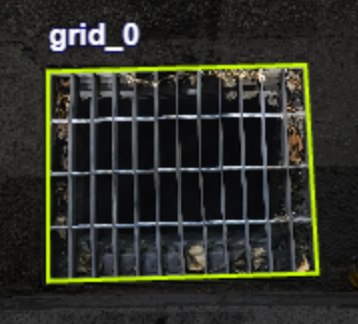
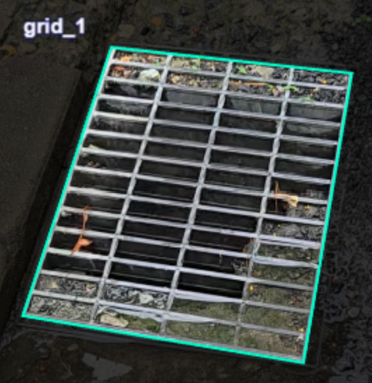
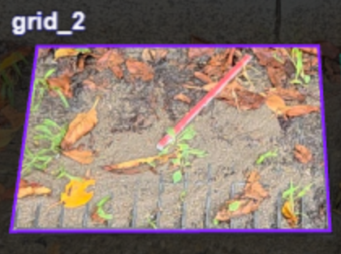
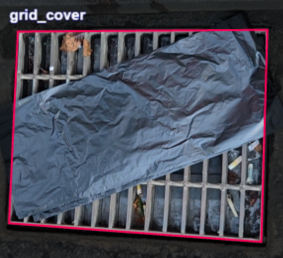

# AI로 관리하는 침수 안전망 — 빗물받이 스마트 대시보드

> 팀 빗물빗물 | 서초 IT 아카데미 프로젝트

서울시 서초구의 빗물받이 상태를 현장 사진으로 기록하고,  
AI 분석과 기상 데이터를 결합해 침수 위험도를 시각화하는 관리자용 웹 대시보드

<br>

## 배경

서초구에는 현재 약 **32,000개**의 빗물받이가 설치되어 있습니다.  
빗물받이는 집중호우 시 도로 침수를 막는 핵심 1차 방어선 역할을 하지만,  
낙엽·쓰레기·토사·덮개 등으로 막히면 배수 효율이 크게 저하됩니다.

특히 **골목길·이면도로**는 점검 사각지대로 반복적인 침수 위험에 노출되어 있고,  
현행 인력 중심 관리 방식으로는 신속한 모니터링과 대응에 한계가 있습니다.

이 프로젝트는 현장 사진 한 장으로 빗물받이 상태를 자동 분류하고,  
침수 이력·강수 예보를 결합해 **우선 관리 구역을 선제적으로 파악**하는 시스템입니다.

<br>

## 데이터 수집

빗물받이 이미지 데이터는 두 가지 방식으로 수집했습니다.

- **직접 촬영**: 서초구 현장 방문 후 각 상태별 빗물받이 직접 촬영
- **네이버 RoadView**: 도로뷰에서 서초구 주요 도로의 빗물받이 이미지 추출
- **서초구청 제공**: 빗물받이 현황 데이터 협조

수집한 이미지는 **Roboflow**로 라벨링하고 YOLO data augmentation을 적용해 학습 데이터를 구성했습니다.

<br>

## AI 분류 — YOLOv11 세그멘테이션

직접 촬영 및 네이버 RoadView로 수집한 이미지를 Roboflow로 라벨링해 4개 클래스로 학습했습니다.

<table>
  <tr>
    <th align="center">grid_0</th>
    <th align="center">grid_1</th>
    <th align="center">grid_2</th>
    <th align="center">grid_cover</th>
  </tr>
  <tr>
    <td align="center"></td>
    <td align="center"></td>
    <td align="center"></td>
    <td align="center"></td>
  </tr>
  <tr>
    <td align="center">정상</td>
    <td align="center">부분 막힘</td>
    <td align="center">완전 막힘</td>
    <td align="center">덮개</td>
  </tr>
  <tr>
    <td align="center">S = 0.0</td>
    <td align="center">S = 0.5</td>
    <td align="center">S = 1.0</td>
    <td align="center">S = 1.0</td>
  </tr>
</table>

현장 사진의 **EXIF GPS 메타데이터**를 자동 파싱해 별도 위치 입력 없이 행정동을 특정합니다.

<br>

## 위험도 점수 산출

4개 지표를 가중합산해 빗물받이별 위험도를 0~100점으로 계산합니다.

```
위험도 = 100 × (H×0.20 + S×0.40 + R×0.20 + P×0.30)
```

| 지표 | 의미 | 산출 방법 |
|------|------|-----------|
| **H** History | 과거 침수 이력 | 서울시 침수흔적도(2020·2022·2023·2024)와 공간 조인 |
| **S** State | 현재 시설 상태 | YOLO 분류 결과 (0.0 ~ 1.0) |
| **R** Recency | 마지막 점검 경과일 | 7일 이내 0.0 → 1년 초과 1.0 |
| **P** Precipitation | 향후 3일 강수 예보 | 기상청 단기예보 API 실시간 조회 |

**등급**: 🟢 안전 (0~40) / 🟡 관리요망 (40~60) / 🟠 위험 (60~80) / 🔴 고위험 (80~100)

<br>

## 주요 화면

### 종합현황
- 서초구 18개 행정동의 위험도 분포 지도 (위험 비율에 따라 녹색 → 빨강 색상)
- 행정동 클릭 시 빗물받이 개수·등급별 현황·3일 강수 예보 팝업 표시
- 위험도 상위 빗물받이 목록, 행정동별 상태 분포 차트

### 지역 상세 관리
- 빗물받이 마커 지도 (마커 클릭 시 원본·예측 이미지 팝업)
- 연도별 침수흔적도 레이어 토글 (2020·2022·2023·2024)

### 이미지 업로드
- 현장 사진 업로드 → YOLO 추론 → GPS 파싱 → 행정동 자동 매핑 → 기록 저장

<br>

## 기술 스택

| 분류 | 기술 |
|------|------|
| AI 모델 | YOLOv11-seg (Ultralytics) |
| 데이터 전처리 | Roboflow, YOLO data augmentation |
| 웹 프레임워크 | Streamlit, Folium |
| 지리 데이터 | GeoPandas, Shapely |
| 시각화 | Plotly, Altair |
| 외부 API | 기상청 단기예보 (공공데이터포털) |
| 이미지 처리 | Pillow (EXIF GPS 추출) |
| 개발 환경 | Colab, VSCode, Conda |
| 협업 | Slack, Notion, Google Drive |

<br>

## 데이터 출처

- **서울시 침수흔적도** (2020·2022·2023·2024): 서울특별시 열린데이터광장
- **서울 행정동 경계** (2017): 서울특별시
- **단기예보 API**: 기상청 (공공데이터포털)
- **빗물받이 현황 데이터**: 서초구청 제공

<br>

## 팀원 및 역할

| 이름 | 담당 |
|------|------|
| 김시현 | 서비스 구현, 자료조사 총괄 |
| 김민지 | 모델 학습, 데이터 수집 총괄 |
| 김현주 | 발표, 데이터 라벨링 총괄 |

<br>

## 프로젝트 구조

```
drain_map/
├── main.py                       # 앱 진입점, 사이드바 라우팅
├── config.py                     # 데이터 로드, 환경변수 관리
├── model_infer.py                # YOLO 추론 및 이미지 업로드 UI
├── risk_calc.py                  # 위험도 계산, 기상청 API 호출
├── map_view.py                   # Folium 지도 (행정동 경계·침수흔적도·마커)
├── dashboard_components_test.py  # 대시보드 UI 컴포넌트
├── data_utils.py                 # EXIF GPS 추출, 행정동 매핑, CSV 저장
├── docs/                         # README 이미지 리소스
├── data/
│   ├── stations_meta.csv
│   ├── 서울_행정동_경계_2017.geojson
│   └── 20XX년 서울특별시 침수흔적도/
├── results/
│   ├── records.csv
│   └── images/
└── yolov11_seg/best.pt
```
